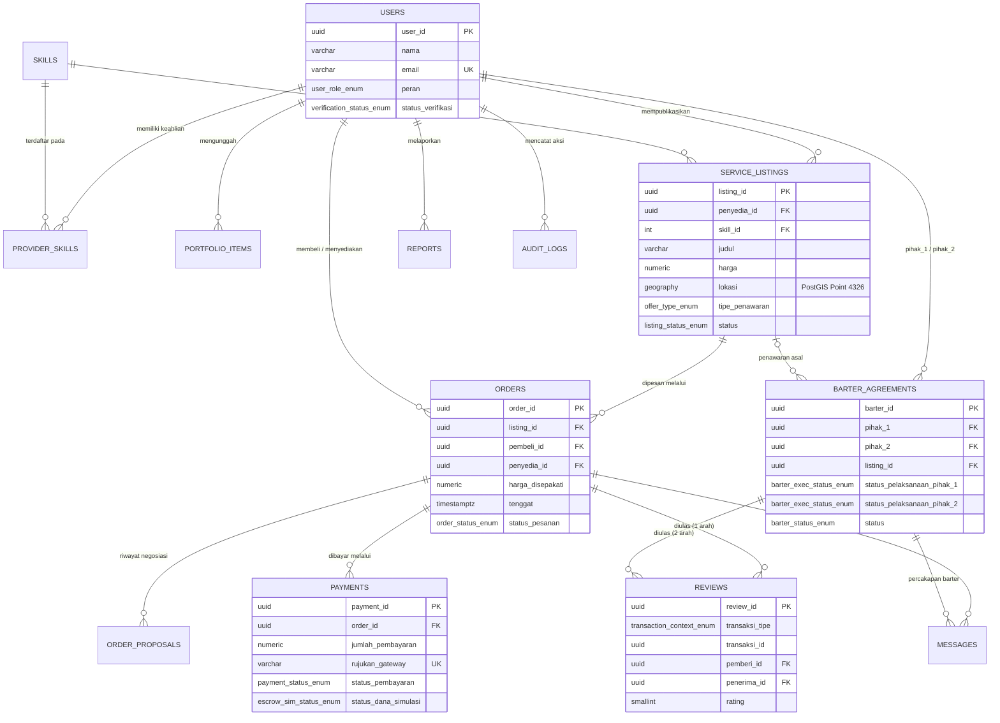

# ERD Ringkas SakuSkill (SKPL Revisi 1.1)

Diagram relasi antarentitas basis data PostgreSQL + PostGIS sesuai **Subbab 3.2.3 (Gambar 3.7 & Tabel 3.45)** pada SKPL SakuSkill Revisi 1.1.

```mermaid
erDiagram
    USERS ||--o{ PROVIDER_SKILLS : "memiliki keahlian"
    SKILLS ||--o{ PROVIDER_SKILLS : "terdaftar pada"
    USERS ||--o{ PORTFOLIO_ITEMS : "mengunggah"
    USERS ||--o{ SERVICE_LISTINGS : "mempublikasikan"
    SKILLS ||--o{ SERVICE_LISTINGS : "mengkategorikan"
    SERVICE_LISTINGS ||--o{ ORDERS : "dipesan melalui"
    USERS ||--o{ ORDERS : "membeli / menyediakan"
    ORDERS ||--o{ ORDER_PROPOSALS : "riwayat negosiasi"
    ORDERS ||--o{ PAYMENTS : "dibayar melalui"
    USERS ||--o{ BARTER_AGREEMENTS : "pihak_1 / pihak_2"
    SERVICE_LISTINGS |o--o{ BARTER_AGREEMENTS : "penawaran asal"
    ORDERS ||--o{ REVIEWS : "diulas (1 arah)"
    BARTER_AGREEMENTS ||--o{ REVIEWS : "diulas (2 arah)"
    ORDERS ||--o{ MESSAGES : "percakapan pesanan"
    BARTER_AGREEMENTS ||--o{ MESSAGES : "percakapan barter"
    USERS ||--o{ REPORTS : "melaporkan"
    USERS ||--o{ AUDIT_LOGS : "mencatat aksi"

    USERS {
        uuid user_id PK
        varchar nama
        varchar email UK
        user_role_enum peran
        verification_status_enum status_verifikasi
    }
    SERVICE_LISTINGS {
        uuid listing_id PK
        uuid penyedia_id FK
        int skill_id FK
        varchar judul
        numeric harga
        geography lokasi "PostGIS Point 4326"
        offer_type_enum tipe_penawaran
        listing_status_enum status
    }
    ORDERS {
        uuid order_id PK
        uuid listing_id FK
        uuid pembeli_id FK
        uuid penyedia_id FK
        numeric harga_disepakati
        timestamptz tenggat
        order_status_enum status_pesanan
    }
    PAYMENTS {
        uuid payment_id PK
        uuid order_id FK
        numeric jumlah_pembayaran
        varchar rujukan_gateway UK
        payment_status_enum status_pembayaran
        escrow_sim_status_enum status_dana_simulasi
    }
    BARTER_AGREEMENTS {
        uuid barter_id PK
        uuid pihak_1 FK
        uuid pihak_2 FK
        uuid listing_id FK
        barter_exec_status_enum status_pelaksanaan_pihak_1
        barter_exec_status_enum status_pelaksanaan_pihak_2
        barter_status_enum status
    }
    REVIEWS {
        uuid review_id PK
        transaction_context_enum transaksi_tipe
        uuid transaksi_id
        uuid pemberi_id FK
        uuid penerima_id FK
        smallint rating
    }
```
